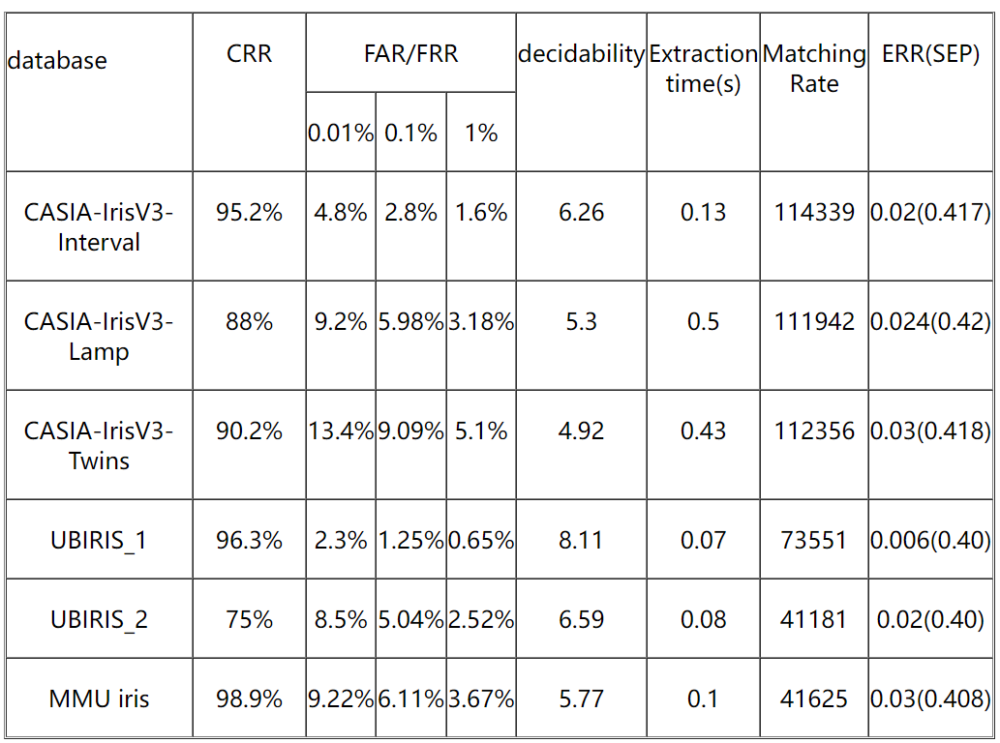

# GIRIST (GRUS IRIS TOOL)

GIRIST (GRUS IRIS TOOL) is a open source iris recognition lib by GRUSOFT. 

Some **Key Features** of GIRIST
- Average Decidability > 6.0
- Average Correct Recognition Rate >95%
- When FAR=0.01%, average FRR=5%
- Average Extraction time <0.4s
- Match rate>50000 irises/second
- Handle noises such as eyelash, eyelids and strong reflections
- Upper limit of Rotation Angle:  ±15 degrees
- No limits on size of iris.
- Unlimited database size
- Three mode: iris authentication, iris identification and iris library verification
  

## Performance

The performance of the GIRIST was tested on 6 datasets, 3 of CASIA, 2 of UBIRIS and MMU. 

Table 1 lists the detail of these datasets. 

##### 									Table 1: Six iris datasets

|   database          |     No of Images      |     No of Classes      |    Image size       |  Intra-Class Comparisons   |        Inter-Class Comparisons        | characteristic               |
| ----------- | :------------: | :------------: | :------------------: | :----------: | :-----------------: | :-------------------- |
| CASIA-IrisV3-Interval    |     2655      |      396      |         320*280         |     18042     |        7028328         | Very good image quality with extremely clear iris texture details                  |
| CASIA-IrisV3-Lamp  |      16213      |      819      |         640*480         |     306218      |         262538938         | Nonlinear deformation due to variations of visible illumination                   |
| CASIA-IrisV3-Twins        |      3183      |      400      |         640*480         |     24756     |        10103550         | The first publicly available twins’ iris image dataset                  |
| UBIRIS_1    |       1214       |       241       |           200*150          |     4634      |         1377166         | to minimize noise factors, specially those relative to reflections, luminosity and contrast                  |
| UBIRIS_2     | 662 | 241 |      200*150      |  1990  |     301060      | to introduce natural luminosity factor. This propitiates the appearance of heterogeneous images with respect to reflections, contrast, luminosity and focus problems.        |
| MMU1 iris |  450  |  90  | 320*240 | 1800 | 200250 |  |

The following table lists the **accuracy** of GIRIST on these datasets:

## License

The provided implementation is strictly for academic purposes  and personal usage only. If anyone is interested in using our technology for any commercial use, please contact us.

## Author

Yingshi Chen (gsp.cys@gmail.com)

